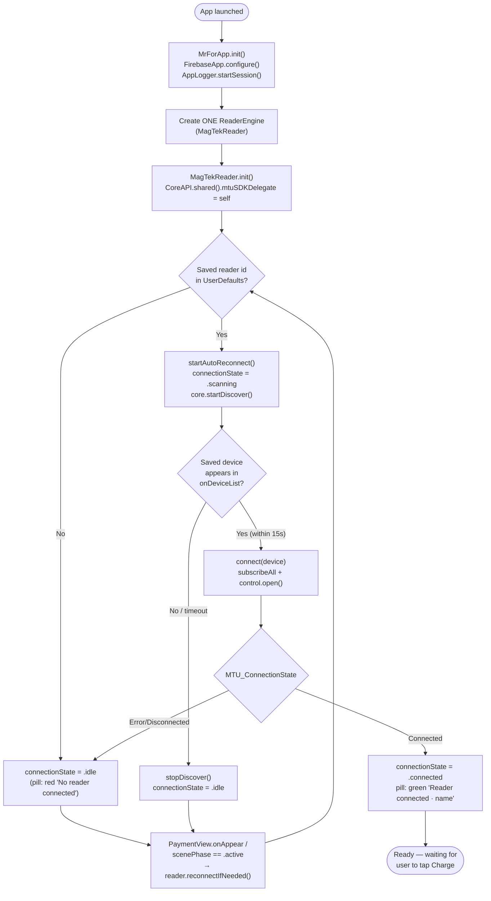
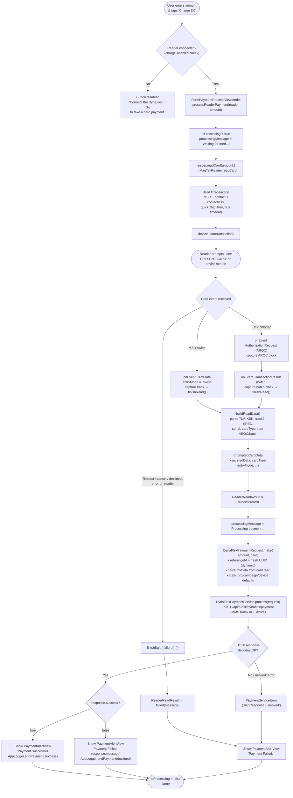

# MrFor — Architecture Diagrams

These diagrams describe the production app + API path only (no localhost /
sandbox eventExplore server, no simulator-only fallbacks shown). Render with
the Mermaid preview in VS Code, or paste into any Mermaid-compatible viewer
(GitHub, mermaid.live, etc.).

---

## 1. Component Diagram

Shows how the app's pieces connect: UI → ViewModel → Reader Engine (MagTek
SDK) → DynaFlex II Go hardware, and UI/ViewModel → Networking → MMS Kiosk API
(Azure) → Forte/Magensa (processor side, outside this app).

```mermaid
graph TB
    subgraph DEVICE["DynaFlex II Go (Bluetooth reader hardware)"]
        HW[["💳 DynaFlex II Go\n(EMV chip / tap / swipe)"]]
    end

    subgraph APP["MrFor iOS App"]
        direction TB

        subgraph UI["SwiftUI Views"]
            PV["PaymentView\n(amount, charge button,\nconnection pill)"]
            BDV["BluetoothDevicesView\n(device list, pair/connect,\nTap to Pay debug read)"]
            RCV["ReceiptView / PaymentAlertView\n(result UI)"]
        end

        subgraph VM["View Models"]
            FPVM["FortePaymentProcessViewModel\n(orchestrates read → charge → alert)"]
        end

        subgraph READER["Reader Engine Layer (ReaderEngineProtocol)"]
            RE["ReaderEngine\n(typealias, 1 instance,\nowned by MrForApp)"]
            MTR["MagTekReader\n(MTUSDK-backed engine)"]
            RM["ReaderModels\n(shared types: ReaderDevice,\nEncryptedCardData, states)"]
        end

        subgraph NET["Networking Layer"]
            EP["APIEndpoint\n(dynaFlexPayment → MMS Kiosk URL)"]
            PM["DynaFlexPaymentModels\n(Request/Response + Service)"]
        end

        subgraph SDK["MagTek Universal SDK (MTUSDK.xcframework)"]
            CORE["CoreAPI.shared()\n(BLE discovery, pairing,\ntransaction, events)"]
        end

        APPROOT["MrForApp\n(creates the single ReaderEngine,\nreacts to scenePhase)"]
    end

    subgraph BACKEND["MMS Kiosk API (Azure) — production"]
        MMS["POST /api/Kiosk/dynaflex/payment\n(mmsapiapp-dev.azurewebsites.net)"]
    end

    subgraph PROCESSOR["Payment Processor (outside app)"]
        FORTE["Forte / Magensa\n(decrypts SRED, authorizes,\nsettles the card)"]
    end

    %% Wiring
    APPROOT -->|owns & injects| RE
    RE -.->|typealias resolves to| MTR
    MTR -->|uses| RM
    MTR -->|drives| CORE
    CORE <-->|Bluetooth LE| HW

    PV -->|injected reader| RE
    BDV -->|injected reader| RE
    PV --> FPVM
    FPVM -->|readCard(amount:)| RE
    FPVM -->|DynaFlexPaymentRequest.make| PM
    PM --> EP
    EP -->|HTTPS JSON POST| MMS
    MMS -->|encrypted card data,\namount, refs| FORTE
    FORTE -->|approve/decline| MMS
    MMS -->|JSON response| PM
    PM --> FPVM
    FPVM -->|alert / receipt| RCV
    FPVM --> PV

    classDef backend fill:#1f6feb,color:#fff,stroke:#0d419d;
    classDef hw fill:#238636,color:#fff,stroke:#1a7f37;
    classDef processor fill:#8250df,color:#fff,stroke:#6639ba;
    class MMS backend
    class HW hw
    class FORTE processor
```

**Key points**
- `MrForApp` constructs **one** `ReaderEngine` for the app's whole lifetime and injects it into `ContentView → PaymentView / BluetoothDevicesView` (never re-created per view).
- `MagTekReader` wraps MagTek's `CoreAPI` singleton and is the only thing that talks Bluetooth to the DynaFlex II Go.
- `FortePaymentProcessViewModel` is the single orchestrator: it asks the reader for a card read, builds the API request, calls the MMS Kiosk API, and turns the result into UI state (`alert`, `receiptTransactionID`).
- The only production network call is `POST /api/Kiosk/dynaflex/payment` to the MMS Kiosk API on Azure; the processor (Forte/Magensa) is reached by that backend, not directly by the app.

---

## 2. Activity Diagram — App Launch → Reader Ready

End-to-end flow from cold launch through auto-reconnecting to a previously
paired DynaFlex II Go, reflected on the Payment screen.



**Key points**
- Auto-reconnect is triggered both at cold-launch (`MagTekReader.init`) and whenever `PaymentView` appears or the app returns to the foreground (`scenePhase == .active`), so the pill never gets stuck stale.
- A 15s timeout prevents indefinite scanning if the paired reader isn't in range.

---

## 3. Activity Diagram — Charge Amount Flow

The full "tap Charge" journey: read the card from the DynaFlex II Go, send it
to the MMS Kiosk API, and show the result.



**Key points**
- `referenceId` is generated fresh (`UUID().uuidString`) on every charge — required so the MMS Kiosk API doesn't reject repeat calls as a duplicate transaction.
- The reader never exposes a plaintext PAN — only DUKPT-encrypted SRED/ARQC/track data is sent to the MMS Kiosk API, which forwards it to Forte/Magensa for decryption + authorization.
- Every outcome (reader failure, network failure, API decline, API success) funnels into a single `PaymentAlertView`, so the user always sees a clear result.
